# 🚀 UAS-2388010049 — Administrasi Server (Cloud Computing II)

<div align="center">


**Nama:** Muhammad Syifaulqulub Hakim  
**NIM:** 2388010049  
**Mata Kuliah:** Administrasi Server (Cloud Computing II)  
**Dosen Pengampu:** Mohamad Firdaus, M.Kom.  
**Instance AWS:** `UAS-2388010049` | **Region:** ap-southeast-1 (Singapore)

</div>

---

## 📋 Daftar Isi

1. [Deskripsi Project](#-deskripsi-project)
2. [Arsitektur Sistem](#-arsitektur-sistem)
3. [Struktur Repository](#-struktur-repository)
4. [Tech Stack](#-tech-stack)
5. [CI/CD Pipeline (GitHub Actions)](#-cicd-pipeline-github-actions)
6. [Orkestrasi Docker Compose](#-orkestrasi-docker-compose)
7. [Konfigurasi Nginx Reverse Proxy](#-konfigurasi-nginx-reverse-proxy)
8. [Fungsionalitas Aplikasi](#-fungsionalitas-aplikasi)
9. [Automasi Database (MariaDB Seeding)](#-automasi-database-mariadb-seeding)
10. [Konfigurasi GitHub Secrets](#-konfigurasi-github-secrets)
11. [Bukti Screenshot & Live Test](#-bukti-screenshot--live-test)
12. [Cara Menjalankan Lokal](#-cara-menjalankan-lokal)
13. [Akses Aplikasi Produksi (AWS)](#-akses-aplikasi-produksi-aws)

---

## 📌 Deskripsi Project

Project ini mengimplementasikan arsitektur **Cloud Native** dengan pipeline **CI/CD penuh** (Zero-Touch Deployment) menggunakan GitHub Actions, Docker Hub, dan AWS EC2. Sistem terdiri dari:

| Aplikasi | Teknologi | Deskripsi |
|---|---|---|
| **Web Statis** | HTML, CSS, JavaScript | CV/Portfolio pribadi (dari UTS) |
| **Web Dinamis** | PHP 8.2 MVC + MariaDB | Gunung News — Portal berita gunung |
| **Reverse Proxy** | Nginx Alpine | Routing traffic ke masing-masing app |
| **Database** | MariaDB 10.11 | Data seeding otomatis via `init.sql` |

Setiap push ke branch `main` akan secara **otomatis** membangun Docker Image, mendorongnya ke Docker Hub, dan men-deploy ulang kontainer di EC2 **tanpa downtime signifikan**.

---

## 🏗️ Arsitektur Sistem

```
┌─────────────────────────────────────────────────────────────┐
│                    DEVELOPER (Local)                        │
│  git push → GitHub → GitHub Actions (CI/CD Runner)         │
└─────────────────────────┬───────────────────────────────────┘
                          │ Trigger on push (paths filter)
                          ▼
┌─────────────────────────────────────────────────────────────┐
│               GITHUB ACTIONS PIPELINE                        │
│                                                             │
│  [Build & Push Docker Image]  ──►  [Deploy to AWS EC2]     │
│       docker/build-push-action       appleboy/scp-action   │
│       → hakim0901/web_statis         appleboy/ssh-action   │
│       → hakim0901/web_dinamis                               │
└─────────────────────────┬───────────────────────────────────┘
                          │ docker pull + docker compose up
                          ▼
┌─────────────────────────────────────────────────────────────┐
│           AWS EC2 Instance (UAS-2388010049)                  │
│           Public IP: 18.141.73.236                          │
│           Region: ap-southeast-1 (Singapore)                │
│                                                             │
│  ┌──────────────────────────────────────────────────────┐   │
│  │              Docker Network: app_network              │   │
│  │                                                      │   │
│  │  ┌─────────────────┐    Port 80  ┌───────────────┐  │   │
│  │  │  nginx_proxy    │◄────────────│  web_statis   │  │   │
│  │  │  (nginx:alpine) │             │ (PHP/HTML CV) │  │   │
│  │  │  Port 80:80     │    Port 3000 └───────────────┘  │   │
│  │  │  Port 3000:3000 │◄────────────┌───────────────┐  │   │
│  │  └─────────────────┘             │  web_dinamis  │  │   │
│  │                                  │  (PHP 8.2 MVC)│  │   │
│  │                                  └───────┬───────┘  │   │
│  │                                          │ depends_on│   │
│  │                                  ┌───────▼───────┐  │   │
│  │                                  │    mariadb    │  │   │
│  │                                  │  (MariaDB     │  │   │
│  │                                  │   10.11)      │  │   │
│  │                                  │  Port 3306    │  │   │
│  │                                  └───────────────┘  │   │
│  └──────────────────────────────────────────────────────┘   │
└─────────────────────────────────────────────────────────────┘
```

**Alur Traffic Publik:**
- `http://IP:80` → Nginx → `web_statis:80` (CV HTML)
- `http://IP:3000` → Nginx → `web_dinamis:80` (Gunung News PHP)

---

## 📁 Struktur Repository

```
UAS-2388010049/
├── .github/
│   └── workflows/
│       ├── web_statis.yml      # Pipeline CI/CD untuk Web Statis
│       └── web_dinamis.yml     # Pipeline CI/CD untuk Web Dinamis
│
├── web_statis/
│   ├── Dockerfile              # Build image Nginx untuk CV HTML
│   └── index.html              # Halaman CV/Portfolio
│
├── web_dinamis/
│   ├── Dockerfile              # Build image PHP 8.2 Apache
│   ├── db/
│   │   └── init.sql            # Script seeding otomatis MariaDB
│   └── src/
│       ├── index.php           # Entry point (front controller)
│       ├── config/             # Konfigurasi koneksi database
│       ├── models/             # Model (User, Article)
│       ├── controllers/        # Controller (ArticleController, Auth)
│       └── views/              # Tampilan (layout, articles, auth)
│
├── nginx/
│   └── default.conf            # Konfigurasi Reverse Proxy Nginx
│
├── docker-compose.yml          # Orkestrasi semua kontainer
├── .env.example                # Template variabel environment
├── .gitignore
└── README.md                   # Dokumentasi ini
```

---

## 🛠️ Tech Stack

| Komponen | Teknologi | Versi |
|---|---|---|
| CI/CD Automation | GitHub Actions | - |
| Container Registry | Docker Hub | hakim0901 |
| Cloud Provider | AWS EC2 | t3.micro (Ubuntu 26.04 LTS) |
| Reverse Proxy | Nginx | Alpine |
| Web Statis | HTML + CSS + JavaScript | - |
| Web Dinamis | PHP + Apache | 8.2 |
| Database | MariaDB | 10.11 |
| Container Runtime | Docker + Docker Compose | v29.5.3 / v5.1.4 |

---

## ⚙️ CI/CD Pipeline (GitHub Actions)

Pipeline dibagi menjadi **dua file terpisah** menggunakan fitur **Paths Filter** sehingga terisolasi dan efisien — hanya pipeline yang relevan yang berjalan ketika ada perubahan.

### Diagram Alur Pipeline

```
git push ke main
      │
      ├─── perubahan di web_statis/** ──► web_statis.yml ──► Build → Push → SCP → SSH Deploy
      │
      └─── perubahan di web_dinamis/** ─► web_dinamis.yml ─► Build → Push → SCP → SSH Deploy
```

### `web_statis.yml` — Pipeline Web Statis

```yaml
name: CI/CD — Web Statis

on:
  push:
    branches: [main]
    paths:
      - "web_statis/**"
      - ".github/workflows/web_statis.yml"

env:
  IMAGE_NAME: hakim0901/web_statis

jobs:
  build-push:
    name: Build & Push Docker Image
    runs-on: ubuntu-latest
    steps:
      - uses: actions/checkout@v4
      - uses: docker/login-action@v3
        with:
          username: ${{ secrets.DOCKERHUB_USERNAME }}
          password: ${{ secrets.DOCKERHUB_TOKEN }}
      - uses: docker/build-push-action@v5
        with:
          context: ./web_statis
          push: true
          tags: |
            ${{ env.IMAGE_NAME }}:latest
            ${{ env.IMAGE_NAME }}:${{ github.sha }}

  deploy:
    name: Deploy to AWS EC2
    needs: build-push
    runs-on: ubuntu-latest
    steps:
      - uses: appleboy/scp-action@v0.1.7   # Copy file ke EC2
        ...
      - uses: appleboy/ssh-action@v1.0.3   # SSH & jalankan compose
        with:
          script: |
            docker pull hakim0901/web_statis:latest
            docker compose up -d --no-deps --force-recreate web_statis nginx
            docker image prune -f
```

### `web_dinamis.yml` — Pipeline Web Dinamis (PHP + DB)

```yaml
name: CI/CD — Web Dinamis (PHP)

on:
  push:
    branches: [main]
    paths:
      - "web_dinamis/**"
      - ".github/workflows/web_dinamis.yml"
```

Pipeline web dinamis menambahkan langkah ekstra:
- Mendeploy `db` container terlebih dahulu
- Menunggu MariaDB sehat (`sleep 15`)
- Baru kemudian pull dan restart `web_dinamis` + `nginx`

```bash
docker compose up -d db
echo "⏳ Waiting for MariaDB to be ready..."
sleep 15
docker pull hakim0901/web_dinamis:latest
docker compose up -d --no-deps --force-recreate web_dinamis nginx
docker image prune -f
echo "✅ Web Dinamis deployed successfully!"
```

### ✅ Keunggulan Arsitektur Pipeline

| Fitur | Keterangan |
|---|---|
| **Paths Filter** | Setiap pipeline hanya trigger saat file relevan berubah |
| **Image Tagging** | Dual tag: `:latest` + `:${{ github.sha }}` untuk traceability |
| **Zero Downtime** | `--no-deps --force-recreate` hanya restart container yang berubah |
| **Auto Cleanup** | `docker image prune -f` membersihkan image lama otomatis |
| **Secret Management** | Semua credential disimpan di GitHub Secrets, tidak hardcoded |

---

## 🐳 Orkestrasi Docker Compose

File `docker-compose.yml` mendefinisikan seluruh infrastruktur dengan arsitektur yang bersih:

```yaml
version: "3.9"

networks:
  app_network:
    driver: bridge        # Jaringan internal terisolasi

volumes:
  db_data:               # Volume persisten untuk data MariaDB

services:
  nginx:                 # Reverse Proxy
    image: nginx:alpine
    ports:
      - "80:80"          # Web Statis (publik)
      - "3000:3000"      # Web Dinamis (publik)
    depends_on:
      - web_statis
      - web_dinamis

  web_statis:            # CV HTML
    image: hakim0901/web_statis:latest
    expose:
      - "80"             # Hanya internal, tidak expose ke host

  web_dinamis:           # Gunung News PHP MVC
    image: hakim0901/web_dinamis:latest
    environment:
      DB_HOST: db        # DNS internal Docker
      DATABASE_HOST: db
      DB_NAME: app_db
      DB_USER: appuser
      DB_PASS: ${DB_PASS:-apppassword}
    depends_on:
      db:
        condition: service_healthy  # Tunggu DB ready

  db:                    # MariaDB dengan healthcheck
    image: mariadb:10.11
    volumes:
      - db_data:/var/lib/mysql                            # Persisten!
      - ./web_dinamis/db/init.sql:/docker-entrypoint-initdb.d/init.sql:ro
    expose:
      - "3306"           # Hanya internal, tidak expose ke publik
    healthcheck:
      test: ["CMD", "healthcheck.sh", "--connect", "--innodb_initialized"]
      interval: 10s
      timeout: 5s
      retries: 5
      start_period: 30s
```

### 🏆 Fitur Best Practice yang Diimplementasikan

| Fitur | Implementasi |
|---|---|
| **DNS Internal** | `DB_HOST: db` — komunikasi via nama service, bukan IP |
| **Secret via Env** | Credential dari `.env` file, tidak hardcoded di YAML |
| **depends_on + healthcheck** | `web_dinamis` hanya start setelah `db` healthy |
| **Volume Persisten** | `db_data:/var/lib/mysql` — data tidak hilang saat restart |
| **Port Tidak Expose** | DB & app hanya `expose` (internal), bukan `ports` (publik) |
| **Restart Policy** | `restart: unless-stopped` — auto-recovery dari crash |

---

## 🌐 Konfigurasi Nginx Reverse Proxy

```nginx
# Port 80 → Web Statis (CV HTML)
server {
    listen 80;
    server_name _;

    location / {
        proxy_pass         http://web_statis:80;
        proxy_set_header   Host $host;
        proxy_set_header   X-Real-IP $remote_addr;
        proxy_set_header   X-Forwarded-For $proxy_add_x_forwarded_for;
    }
}

# Port 3000 → Web Dinamis (PHP MVC)
server {
    listen 3000;
    server_name _;

    location / {
        proxy_pass         http://web_dinamis:80;
        proxy_set_header   Host $host;
        proxy_set_header   X-Real-IP $remote_addr;
        proxy_set_header   X-Forwarded-For $proxy_add_x_forwarded_for;
    }
}
```

Nginx berfungsi sebagai **single entry point** yang meneruskan request ke service yang tepat berdasarkan port menggunakan nama DNS internal Docker.

---

## 💻 Fungsionalitas Aplikasi

### Web Statis — CV Portfolio
- **URL Produksi:** `http://18.141.73.236:80`
- CV/Portfolio pribadi M. Syifaulqulub Hakim
- Dibangun dengan HTML, CSS, JavaScript murni
- Menampilkan: About, Skills, Experience, Education, Contact

### Web Dinamis — Gunung News (PHP MVC)
- **URL Produksi:** `http://18.141.73.236:3000`
- Portal berita seputar gunung dan pendakian di Indonesia
- Arsitektur **MVC (Model-View-Controller)** dengan PHP 8.2
- Fitur yang tersedia:
  - 🔐 **Login System** (admin/user role)
  - 📰 **CRUD Artikel** (Create, Read, Update, Delete)
  - 🗃️ **Database-driven** — konten dari MariaDB
  - 👤 **Dashboard Admin** — manajemen konten

**Akun Default (dari seeding):**
| Username | Password | Role |
|---|---|---|
| `admin` | `admin123` | Admin |
| `user1` | `user123` | User |
| `user2` | `user123` | User |

---

## 🗄️ Automasi Database (MariaDB Seeding)

File `web_dinamis/db/init.sql` diinjeksikan ke dalam kontainer MariaDB melalui mekanisme `/docker-entrypoint-initdb.d/`. Script ini dieksekusi **secara otomatis** saat kontainer pertama kali dijalankan.

### Struktur Database `app_db`

```sql
-- Tabel users
CREATE TABLE IF NOT EXISTS users (
  id         INT AUTO_INCREMENT PRIMARY KEY,
  username   VARCHAR(64) NOT NULL UNIQUE,
  password   VARCHAR(255) NOT NULL,       -- MD5 hash
  role       ENUM('admin', 'user') DEFAULT 'user',
  created_at TIMESTAMP DEFAULT CURRENT_TIMESTAMP
);

-- Tabel articles (Gunung News)
CREATE TABLE IF NOT EXISTS articles (
  id         INT AUTO_INCREMENT PRIMARY KEY,
  title      VARCHAR(255) NOT NULL,
  content    TEXT NOT NULL,
  excerpt    VARCHAR(500) NOT NULL,
  mountain   VARCHAR(100) NOT NULL,
  created_at TIMESTAMP DEFAULT CURRENT_TIMESTAMP,
  updated_at TIMESTAMP DEFAULT CURRENT_TIMESTAMP ON UPDATE CURRENT_TIMESTAMP
);
```

### Data Seed yang Diinjeksikan Otomatis

**Users:** 3 akun (admin, user1, user2) dengan password ter-hash

**Articles:** 4 artikel berita gunung:
1. *Misteri Keindahan Kawah Ijen: Api Biru yang Mendunia* — Gunung Ijen
2. *Tips Mendaki Gunung Semeru Bagi Pemula di Tahun 2026* — Gunung Semeru
3. *Gunung Merapi Kembali Mengeluarkan Guguran Lava Pijar* — Gunung Merapi
4. *Pesona Sabana Alun-Alun Surya Kencana di Gunung Gede* — Gunung Gede

> **Cara Kerja:** Docker volume mount `./web_dinamis/db/init.sql:/docker-entrypoint-initdb.d/init.sql:ro` memastikan skrip SQL dieksekusi oleh MariaDB saat container fresh start. Idempoten berkat `ON DUPLICATE KEY UPDATE`.

---

## 🔐 Konfigurasi GitHub Secrets

Semua credential sensitif disimpan di **GitHub Repository Secrets** (Settings → Secrets and variables → Actions):

| Secret Name | Deskripsi |
|---|---|
| `AWS_HOST` | Public IP Address EC2 instance |
| `AWS_USERNAME` | Username SSH EC2 (ubuntu) |
| `AWS_PRIVATE_KEY` | Private key (.pem) untuk autentikasi SSH |
| `DOCKERHUB_USERNAME` | Username Docker Hub (`hakim0901`) |
| `DOCKERHUB_TOKEN` | Personal Access Token Docker Hub |
| `DB_PASS` | Password database aplikasi |
| `MYSQL_ROOT_PASSWORD` | Password root MariaDB |

---

## 📸 Bukti Screenshot & Live Test

### 1. AWS EC2 Instance — UAS-2388010049 Running

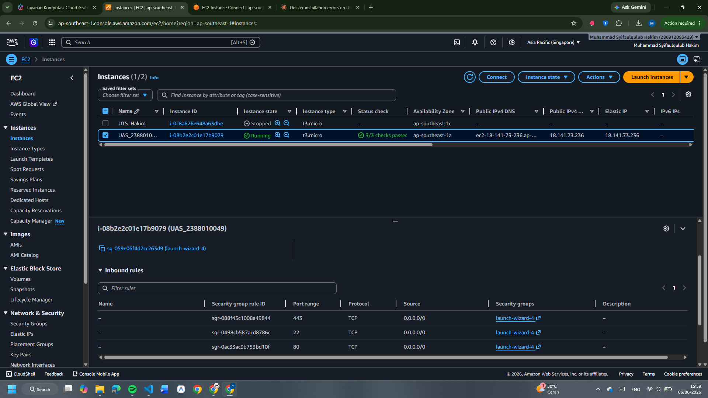

> Instance `UAS-2388010049` dengan status **Running** di region `ap-southeast-1`. Public IP: `18.141.73.236`. Security Group terkonfigurasi dengan inbound rules untuk port **80** (HTTP), **22** (SSH), dan **443** (HTTPS).

---

### 2. Instalasi Docker & Docker Compose di EC2

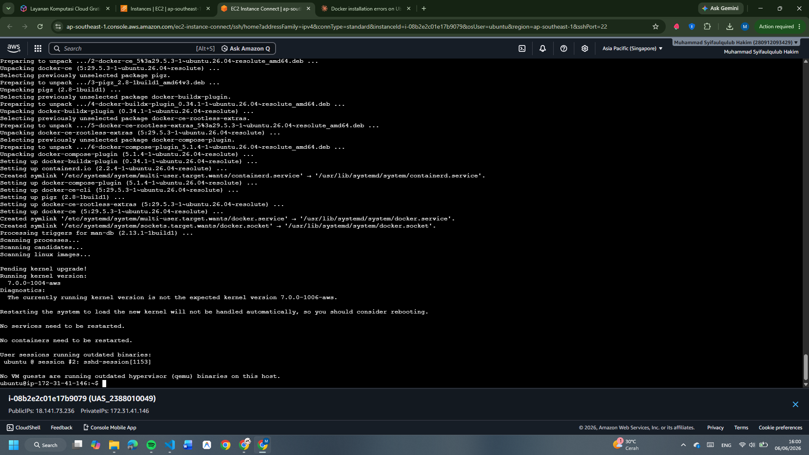

> Log instalasi Docker CE v29.5.3 dan Docker Compose Plugin v5.1.4 berhasil di EC2 Ubuntu 26.04 LTS. Instance ID: `i-08b2e2c01e17b9079`.

---

### 3. Verifikasi Docker Service & Konfigurasi User Group

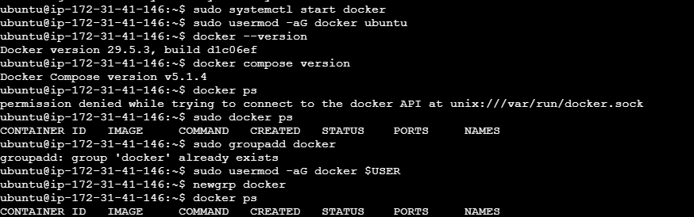

> Docker service berhasil dijalankan. User `ubuntu` ditambahkan ke grup `docker` untuk menjalankan perintah tanpa `sudo`. Docker version: **29.5.3**, Docker Compose version: **v5.1.4**.

---

### 4. Docker Hub — Repositories Terpublikasi

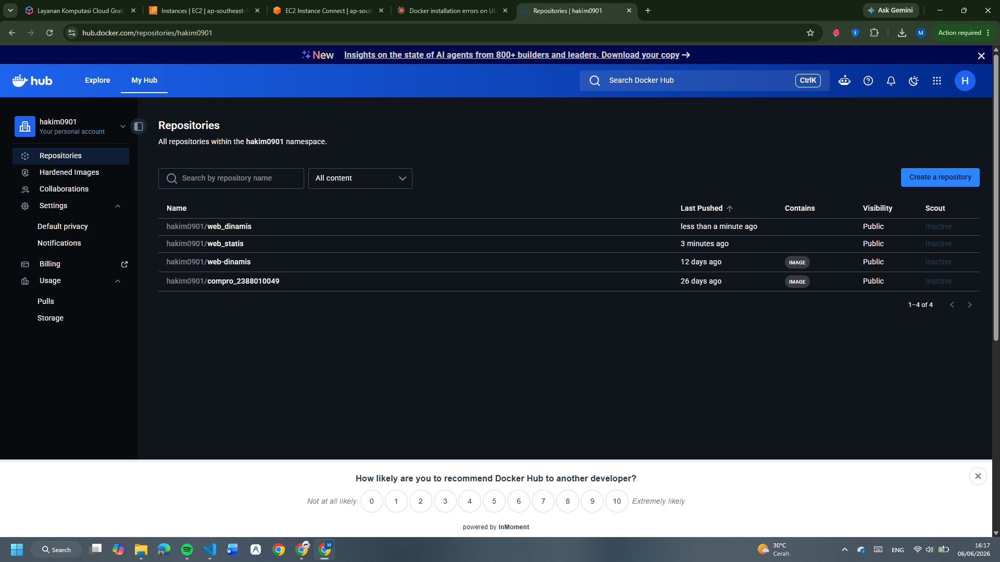

> Repository Docker Hub `hakim0901` menampilkan kedua image yang berhasil dipush:
> - `hakim0901/web_dinamis` — *less than a minute ago* (hasil push terbaru)
> - `hakim0901/web_statis` — *3 minutes ago*

---

### 5. Docker Hub — Personal Access Token UAS

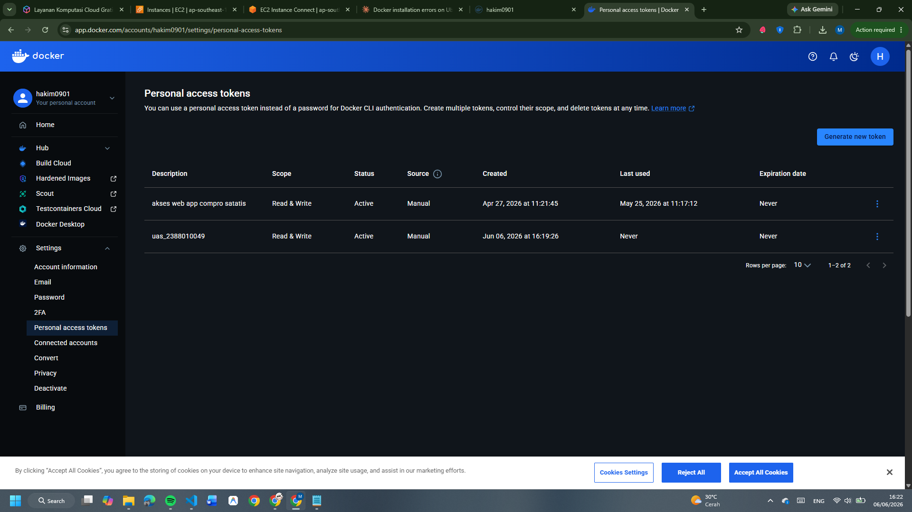

> Token akses personal `uas_2388010049` dengan scope **Read & Write** dibuat khusus untuk pipeline CI/CD UAS ini. Token ini disimpan sebagai `DOCKERHUB_TOKEN` di GitHub Secrets.

---

### 6. GitHub Secrets — Konfigurasi Lengkap

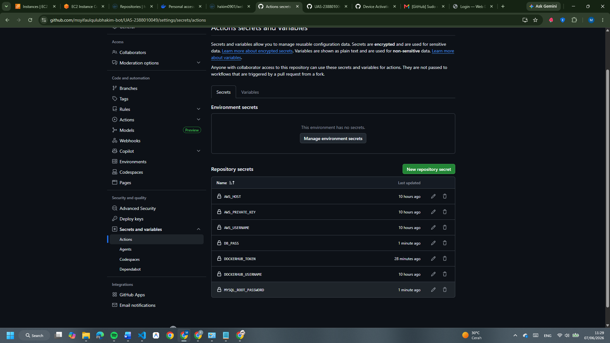

> Semua **7 Secrets** terkonfigurasi dengan benar di repository GitHub:
> - `AWS_HOST`, `AWS_PRIVATE_KEY`, `AWS_USERNAME` — untuk koneksi SSH ke EC2
> - `DB_PASS`, `MYSQL_ROOT_PASSWORD` — untuk autentikasi database
> - `DOCKERHUB_TOKEN`, `DOCKERHUB_USERNAME` — untuk push ke Docker Hub

---

### 7. GitHub Actions — Pipeline Web Dinamis Sukses ✅

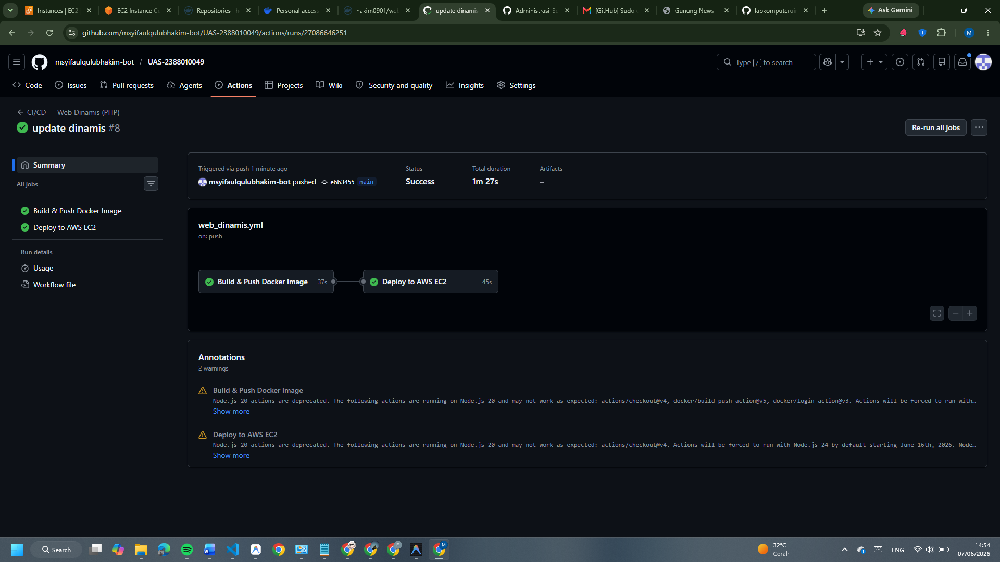

> Pipeline `web_dinamis.yml` run **#8** berhasil dengan status **Success** dalam waktu **1m 27s**.
> - ✅ Build & Push Docker Image: **37s**
> - ✅ Deploy to AWS EC2: **45s**
>
> Triggered oleh push commit `ebb3455` ke branch `main`.

---

### 8. GitHub Actions — Pipeline Web Statis Sukses ✅

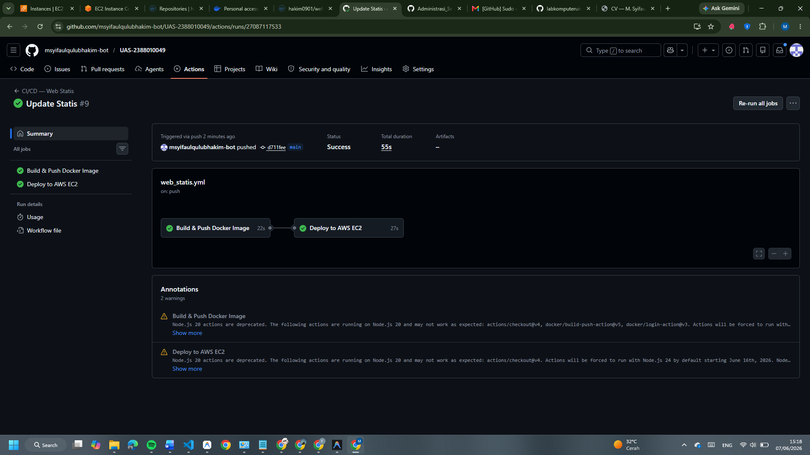

> Pipeline `web_statis.yml` run **#9** berhasil dengan status **Success** dalam waktu **55s** (lebih cepat karena image lebih ringan).
> - ✅ Build & Push Docker Image: **22s**
> - ✅ Deploy to AWS EC2: **27s**
>
> Triggered oleh push commit `d711fee` ke branch `main`.

---

### 9. Web Statis — CV Portfolio Live di AWS (Port 80)

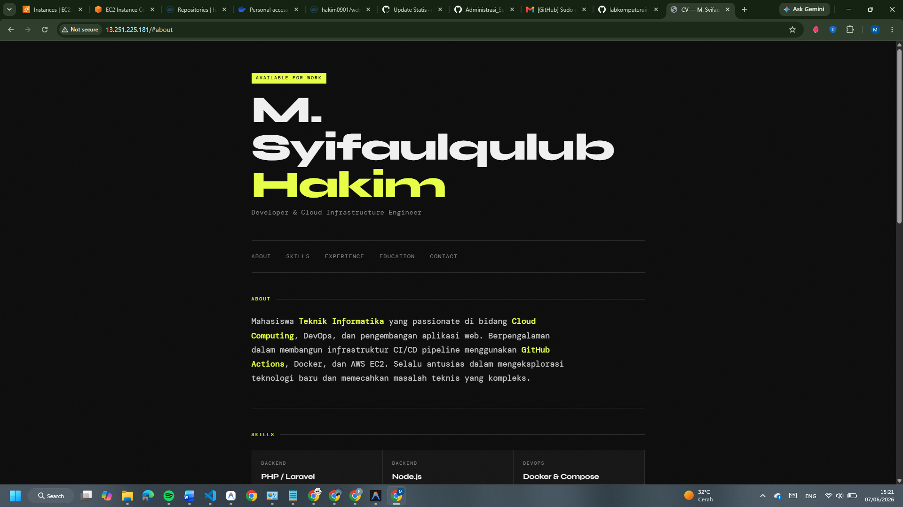

> Halaman CV **M. Syifaulqulub Hakim** berhasil diakses di `http://13.251.225.181` (Port 80) melalui Nginx Reverse Proxy. Menampilkan tagline "Developer & Cloud Infrastructure Engineer" dengan deskripsi keahlian di Cloud Computing, DevOps, dan pengembangan aplikasi web.

---

### 10. Web Dinamis — Gunung News Live di AWS (Port 3000)

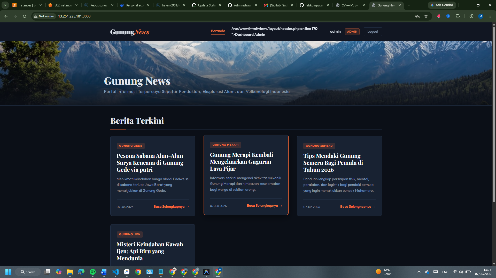

> Aplikasi **Gunung News** berhasil diakses di `http://13.251.225.181:3000` (Port 3000). Dashboard admin aktif, menampilkan 4 artikel yang ter-seeding otomatis dari `init.sql`. Artikel mencakup berita dari Gunung Ijen, Semeru, Merapi, dan Gede.

---

### 11. Verifikasi Container — `docker ps` di EC2 (Port Mapping)

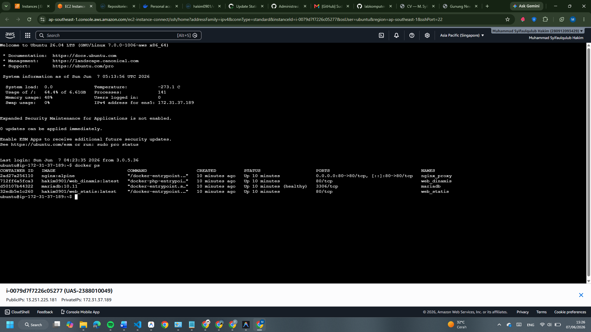

> Output `docker ps` menunjukkan **4 kontainer berjalan sehat** di EC2 instance (`i-0079d7f7226c05277`, Public IP: `13.251.225.181`):
>
> | Container | Image | Status | Ports |
> |---|---|---|---|
> | `nginx_proxy` | `nginx:alpine` | Up 10 minutes | `0.0.0.0:80->80/tcp`, `0.0.0.0:3000->3000/tcp` |
> | `web_dinamis` | `hakim0901/web_dinamis:latest` | Up 10 minutes | `80/tcp` |
> | `mariadb` | `mariadb:10.11` | Up 10 minutes **(healthy)** | `3306/tcp` |
> | `web_statis` | `hakim0901/web_statis:latest` | Up 10 minutes | `80/tcp` |
>
> ✅ MariaDB berstatus **(healthy)** — healthcheck berhasil.  
> ✅ Nginx mengekspose port `80` dan `3000` ke publik.  
> ✅ `web_dinamis` dan `web_statis` hanya internal (tidak ekspose langsung).

---

## 🚀 Cara Menjalankan Lokal

### Prasyarat
- Docker Desktop terinstall
- Git

### Langkah-langkah

```bash
# 1. Clone repository
git clone https://github.com/msyifaulqulubhakim-bot/UAS-2388010049.git
cd UAS-2388010049

# 2. Buat file .env dari template
cp .env.example .env
# Edit .env sesuai kebutuhan (atau biarkan default)

# 3. Jalankan semua container
docker compose up -d

# 4. Verifikasi semua container berjalan
docker ps

# 5. Akses aplikasi
# Web Statis (CV): http://localhost:80
# Web Dinamis (Gunung News): http://localhost:3000
```

### Menghentikan Aplikasi

```bash
docker compose down          # Hentikan container (data DB tetap ada)
docker compose down -v       # Hentikan + hapus volume (data DB hilang)
```

---

## 🌐 Akses Aplikasi Produksi (AWS)

| Aplikasi | URL Produksi | Deskripsi |
|---|---|---|
| **Web Statis (CV)** | `http://18.141.73.236` | Halaman CV/Portfolio via Port 80 |
| **Web Dinamis (Gunung News)** | `http://18.141.73.236:3000` | Aplikasi berita via Port 3000 |

> **Catatan:** IP publik EC2 dapat berubah jika instance di-stop lalu di-start ulang (Elastic IP tidak dikonfigurasi). IP yang tertera adalah IP saat pengujian terakhir.

---

## 🔄 Alur Zero-Touch Deployment (Live Test)

Demonstrasi **Zero-Touch Deployment** — perubahan kode lokal → otomatis update di production:

```bash
# 1. Edit file lokal (contoh: ubah teks di web_dinamis/src/views/)
#    → misal, ganti judul halaman atau tambah artikel baru

# 2. Commit dan push ke GitHub
git add .
git commit -m "update: ubah tampilan halaman utama"
git push origin main

# 3. GitHub Actions otomatis trigger (karena paths filter cocok)
#    → Build Docker Image baru
#    → Push ke Docker Hub (hakim0901/web_dinamis:latest)
#    → SCP copy docker-compose.yml ke EC2
#    → SSH ke EC2, pull image terbaru, restart container

# 4. Dalam ~1-2 menit, perubahan sudah live di:
#    http://18.141.73.236:3000  (tanpa perlu login SSH manual!)
```

---

<div align="center">

**© 2026 — Muhammad Syifaulqulub Hakim (2388010049)**  
*Administrasi Server (Cloud Computing II) — UIN Sunan Gunung Djati Bandung*

</div>
